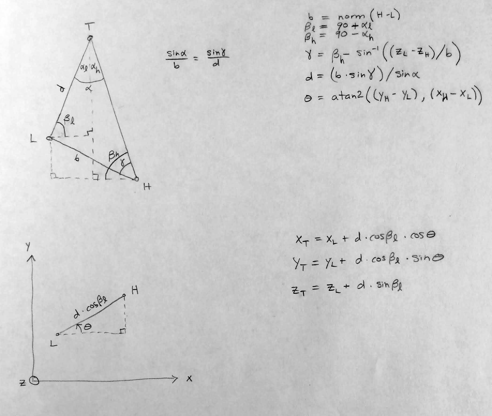
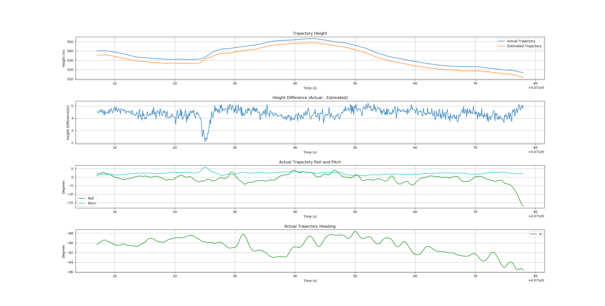
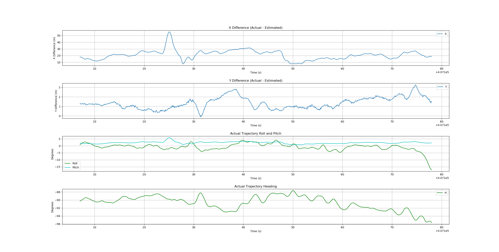
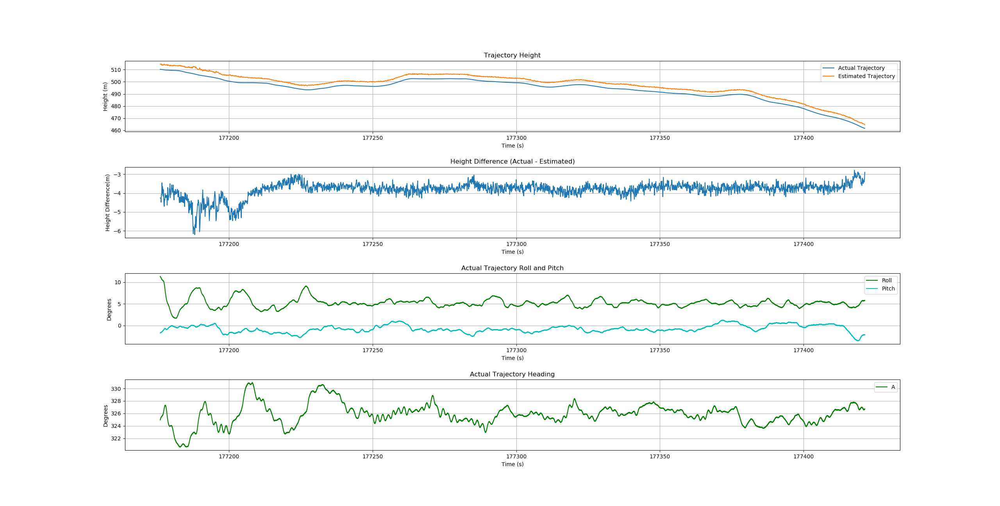
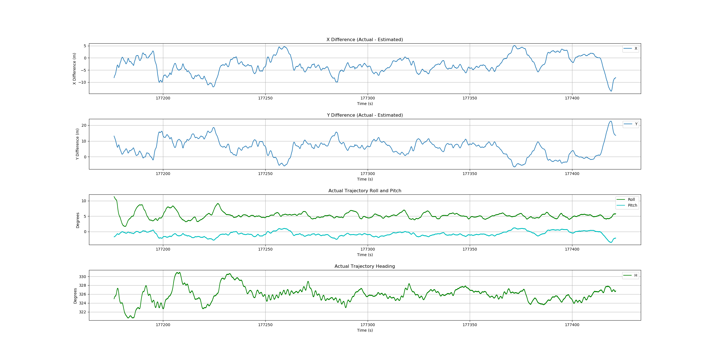
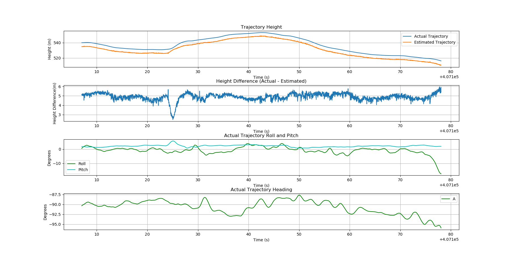
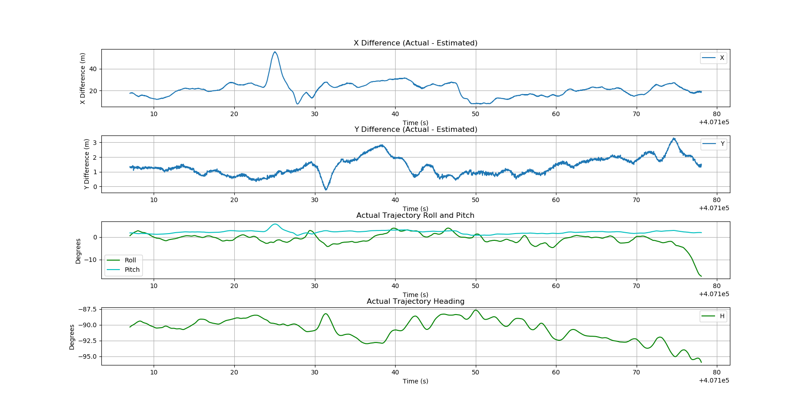

# Airborne lidar sensor trajectory estimation from LAS scan angle field

Given point cloud data sorted by time, estimates of trajectory time and location (XYZ)
are generated from pairs of intersecting rays. For a given point pair (chosen to approximately maximize the difference between their scan angles), a pair of rays originating at the point XYZ locations are formed. The vertical ray directions are defined by each point's scan angle. Horizontally, the rays are directed at their counterpart, thereby forming a triangle. The XYZ location of the top of the triangle is an estimate of the trajectory location.

There are a number of ways to approach this. Two ways are:
1. Similar to Gatziolis & McGaughey's multi-return method, split the data into
time blocks and estimate a single trajectory point for each time block. Each time block's estimated trajectory location (and time) is the average of many triangle solutions (and times) from many point pairs.

    The current method selects point pairs "from the outside in" until a minumum total angle (difference between the scan angles for each point pair) is reached. This results in hundreds to thousands of point pairs within each time block, which smooths the trajectory estimates by averaging the error in the quantized (integer) scan angle values. We have also found that eliminating the extreme scan angles improves the solution.

    This method is contained in branch `master`.

2. Split the data into scan sweeps, where a sweep is a single pass of the laser from maximum to minimum scan angle, or vice versa. For each sweep, find the scan angle "bins" that meet a population density threshold (>= median bin population). Of these, identify the max and min scan angle. Noting the data is still ordered by time, select two point pairs from the bin extremities. These point pairs have opposite scan angle quantization error, and the average of their triangle solutions cancels the error to a large extent.

    We have found that this method works better than method #1 above when sensor dynamics are low (i.e., the lidar sensor was not vibrating or subject to high turbulence), but worse otherwise.

    This method is contained in branch `selective`.

Note that the value of producing a smooth (low random error) trajectory estimate is tempered by the fact that systematic errors due to aircraft pitch (particularly evident in the horizontal errors) will likely be larger than the random errors produced by these methods. Also note that if the scan angle values are stored per the LAS specification (scan angles relative to nadir, thus incorporating aircraft roll), systematic errors due to aircraft roll should be small.

It is expected that a smoothing filter similar to that applied to the multi-return method will be applied to the results produced by these methods.

## Geometry sketch

The sketch below outlines the basic geometry of the point pair triangle solutions. The variable names match those in the `traj_xyz_mean` function in the `traj_sa_funcs.py` file.

## Method #1 Example: UH, Flightline 2 (C2_L2 file)

## Method #1 Example: Sitka, AK, Flightline 160503_011252

## Method #2 Example: UH, Flightline 2 (C2_L2 file)

## Method #2 Example: Sitka, AK, Flightline 160503_011252

## Branch details
- `master` and `selective` branches are explained above.
- `percentage` uses a percentage (instead of a minimum total scan angle threshold) of point pairs (ordered by decreasing total scan angle) used in the time block trajectory estimate. This is a more generic approach as it does not require user knowledge of the scan angle limits in the data. However, it can produce slightly worse results than using a total scan angle threshold. The code change is quite minor, and could be an option in the eventual PDAL filter.
- `master-test` and `percentage-test` contain reorganized code to examine the sensitivity of the estimated trajectory elevation to changes in the total scan angle threshold or percentage.
- `linear-fit` contains an additional alternate method based on scan sweeps (rather than time blocks) that fits a line to the scan angles in each sweep. The linear fit is used to generate non-integer scan angles to remove much of the quantization error. The selective method typically works slightly better than this method.

