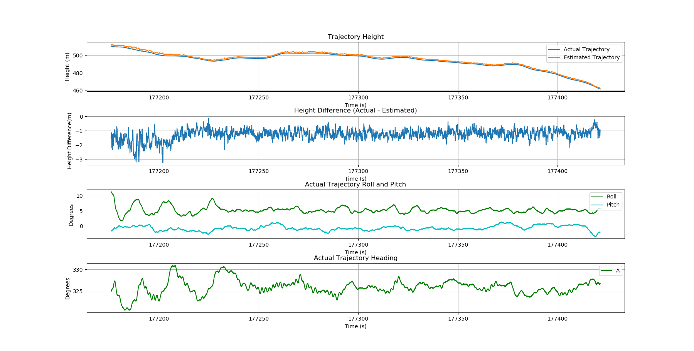
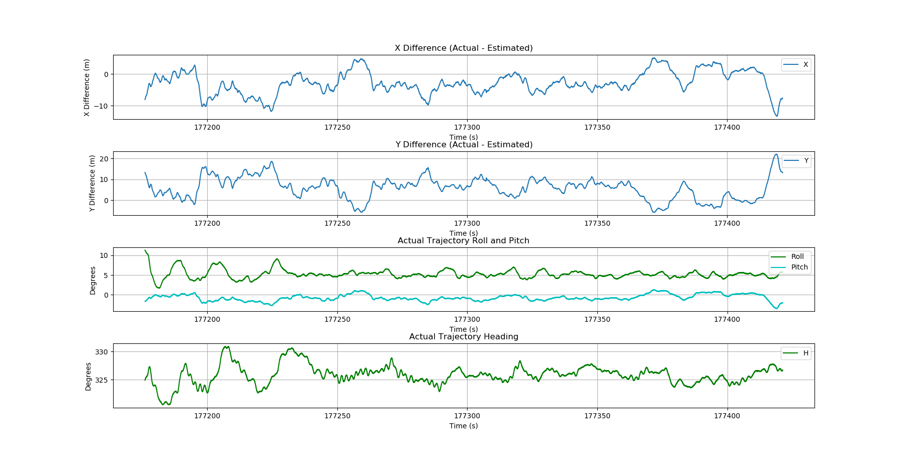
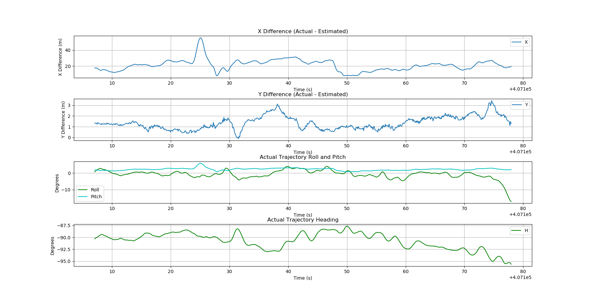

# Airborne lidar sensor trajectory estimation from scan angle

Given point cloud data sorted by time, estimates of trajectory location (XYZ)
are generated from pairs of intersecting rays. For a given point pair (chosen to approximately maximize the difference between their scan angles), a pair of rays originating at the point XYZ locations are formed. The vertical ray directions are defined by each point's scan angle. Horizontally, the rays are directed at their counterpart, thereby forming a triangle. The XYZ location of the top of the triangle is an estimate of the trajectory location.

Similar to Gatziolis & McGaughey's multi-return method, the data is split into
time blocks and a single trajectory point computed for each time block. Each time block's estimated trajectory location (and time) is the average of many triangle solutions (and times) from many point pairs.

We have found that using hundreds to thousands of point pairs within each time block produces smoother trajectory solutions, essentially averaging out the error in the quantized (integer) scan angle values. The current method is naive in the sense that the user must specify the number of point pairs to average within each time block and a minimum range of scan angles (for geometric strength). It may be possible to determine an appropriate number of point pairs and scan angle range for each time block automatically.

However, the value of producing a smooth (low random error) trajectory estimate is tempered by the fact that systematic errors due to aircraft pitch (particularly evident in the horizontal errors) will likely be larger than the random errors produced by this method. Note that if the scan angle values are per the LAS specification (scan angles relative to nadir, thus incorporating aircraft roll), systematic errors due to aircraft roll should be small.

## Geometry sketch

The sketch below outlines the basic geometry of the point pair triangle solutions. The variable names match those in the `traj_xyz_mean` function in the `traj_sa_funcs.py` file.

## Sitka, AK example: Flightline 160503_011252

## UH example: Flightline 2 (C2_L2 file)

